## 20.2 Lesson Plan: Intro to Solidity

### Overview

Today's class will introduce the Solidity programming language to the class. Solidity is the de facto smart contract programming language that is compatible with many blockchains, including Ethereum.

Today's goal is to familiarize students with the strictly typed language features of Solidity enough so they can build a joint savings account smart contract that can store and withdraw ether.

### Class Objectives

By the end of the class, students will be able to:

* Explain the reason Solidity uses static typing (to increase efficiency and decrease costs).

* Store basic data types, such as boolean, string, int, and addresses in Solidity.

* Create a basic smart contract in Solidity.

* Create getters and setters in Solidity, including return type.

* Create basic functions in Solidity
 (in this case, a `deposit` function to add ether, a `withdraw` function to withdraw ether, and a `fallback` function to capture ether).

* Utilize the built-in `payable` modifier in Solidity to give addresses or functions the ability to accept ether.

* Use basic conditionals (if/else) in Solidity.

* Enforce conditionals using the built-in `require` clause in Solidity.

* Articulate the value of adding the `require` function and how it enables better error handling and returns excess gas.

* Deploy and test a smart contract with Remix + Ganache.

### Instructor Notes

* This is the first time students have encountered a strictly typed programming language. This is going to be a very difficult adjustment for the students to make since they are going to have to remember to specify the data types everywhere, as well as use semicolons to end expressions.

* Remind students that if they get frustrated, they are learning something that few are skilled at, and by learning a strictly typed language now, they will be able to learn any other programming language in the future easily.

* Remember to set your Remix compiler version to match your pragma. Otherwise unexpected errors may occur.  The pragma and and compiler version should match as seen in the below image:

    

* Some of todays activities will build off the same files. Remix does not allow opening multiple files with the same name so those files are named uniquely to ease import into Remix.  Instructor files will have the extension `_ins_v1` and student files will have the extension `_stu_v1` with version numbers increasing as the activity numbers increase.    

### Slideshow and Time Tracker

* The slides for this lesson can be viewed on Google Drive here: [20.2 Lesson Slides](https://docs.google.com/presentation/d/1bb1y5kEljdo-mwwTXSMlUCcKKg59tbKArC6ESuojojw/edit?usp=sharing).

* To add the slides to the student-facing repository, download the slides as a PDF by navigating to File, selecting "Download as," and then choosing "PDF document." Then, add the PDF file to your class repository along with other necessary files. You can view instructions for this [here](https://docs.google.com/document/d/1XM90c4s9XjwZHjdUlwEMcv2iXcO_yRGx5p2iLZ3BGNI/edit?usp=sharing).

* **Note:** Editing access is not available for this document. If you wish to modify the slides, create a copy by navigating to File and selecting "Make a copy...".

* The Time Tracker for this lesson can be found here: [Time Tracker](TimeTracker.xlsx).

### Sample Class Video (Highly Recommended)
* To watch an example class lecture, go here: [20.2 Class Video.](https://codingbootcamp.hosted.panopto.com/Panopto/Pages/Viewer.aspx?id=1db75f98-e59c-417f-a885-ab28004ce71c) Note that this video may not reflect the most recent lesson plan.

---

### 1. Instructor Do: Welcome to Class (5 min)

Welcome to Day 2 of Intro to Solidity. Let's start by reviewing some of the concepts that we talked about yesterday and expanding on them a little bit.

* What is Solidity?

 **Answer** Solidity is a high-level, object-oriented programming language. It is the language used to write smart contracts on the Ethereum blockchain.

* What is a smart contract?

 **Answer** A smart contract is essentially just a program that runs on the global computer that is the Ethereum blockchain.

* What is a dApp (Distributed App)?

 **Answer** A dApp is an application stack that leverages one or many smart contracts on the Ethereum blockchain.

* Why are dApps important?

 **Answer:** Instead of relying on centralized infrastructure to run applications, which are prone to censorship and access issues, you can write apps that are secured and powered by the blockchain and pay the world to run your application instead of a single, fallible entity.

 **Answer:** It is a way of writing applications that require the five pillars of open blockchain.

* What are the Five Pillars of Open Blockchains?

 **Answer:** Open, Borderless (Decentralized), Neutral, Censor Resistant, Public

* Why might we be learning Solidity compared to any other programming language?

 **Answer:** We are in an age where blockchain technologies are beginning to shape the world around us in new and exciting ways. Learning Solidity will allow us to build complex decentralized applications that plug directly into Ethereum.

 **Answer:** Solidity is quickly becoming the de facto standard for digital smart contracts, and is supported in multiple blockchains, including Ethereum, Ethereum Classic, Hyperledger Fabric, Quorum, and more.

Let's get the class excited about smart contracts.

* Now that we've reviewed a bit and introduced some interesting concepts, let's begin some coding practice.

* In the first half of class today, we will translate some of the core coding concepts you have learned to a new language, Solidity, and create your first "smart contract".

---

### 2. Instructor Do: First Contract (10 min)

In this activity, you will demonstrate how to construct a basic contract in Solidity that sets an arbitrary `string` and an `address`.

**Files:**

* [first_contract.sol](Activities/01-Ins_First_Contract/Solved/first_contract.sol)

Open your web browser and navigate to the [Remix IDE website](http://remix.ethereum.org):

Enable the `Solidity` development environment if it's disabled.

 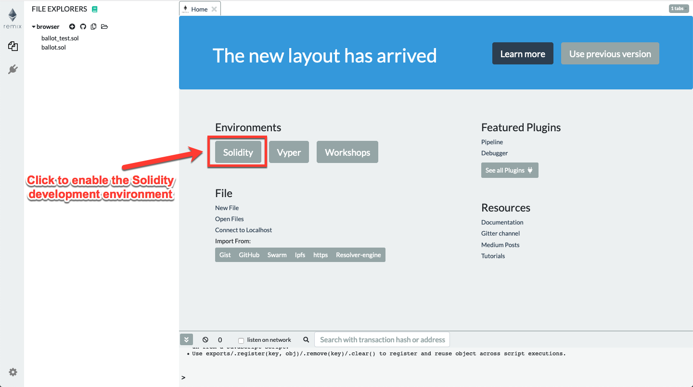

Click on the create new file button in the file explorer:

 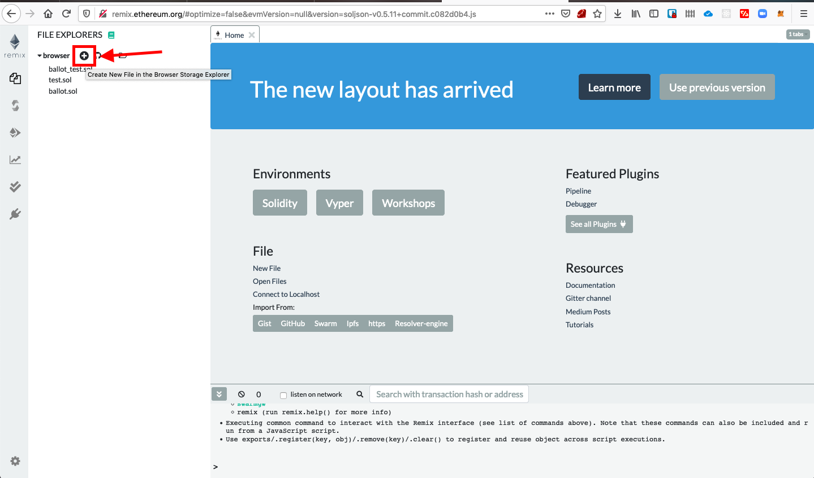

Enter the name of the new Solidity file "message_contract.sol" and click `OK`:

 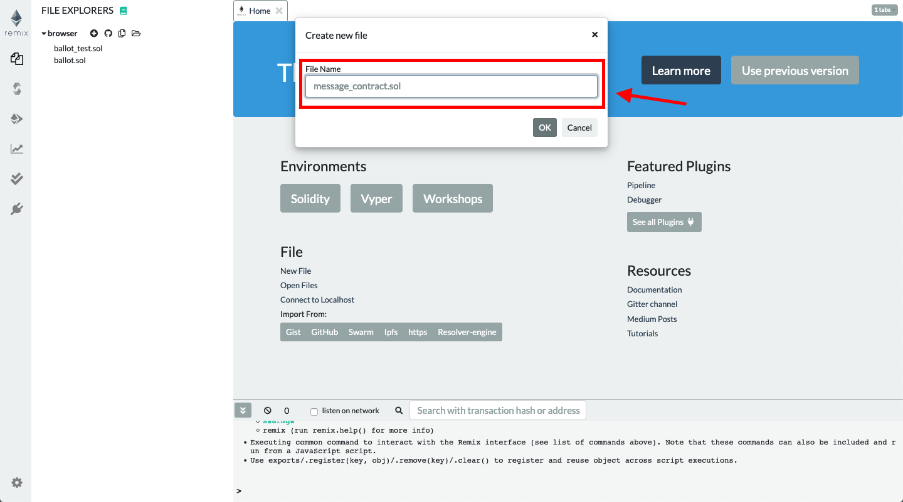

You should now see the following empty editor window:

 

Type the following contract into the editor window:

 ```solidity
 pragma solidity ^0.5.0;

 contract MessageContract {
    address my_address = 0xc3879B456DAA348a16B6524CBC558d2CC984722c;
    string message = "Send me money!";
 }
 ```

Break down the contract to the students:

* Since the Solidity language is always being updated, we have to define what version we are writing our smart contract in. In this class, we're writing version `0.5.0` and up.

 ```solidity
 pragma solidity ^0.5.0;
 ```

* Contracts are specified using a keyword `contract` and a set of curly braces.

 ```solidity
 contract ContractName {}
 ```

* Variables in Solidity require a data type to be specified. In this example, the variable type is a `string`:

 ```solidity
 string message = "Hello World";
 ```

* The `address` variable is a native type that recognizes an Ethereum address and stores it in a way that is cheaper than a string.

 ```solidity
 address my_address = 0xc3879B456DAA348a16B6524CBC558d2CC984722c;
 ```

Take a moment to discuss data types with the class. Explain the following to students:

* In contrast to Python, Solidity is very strict in the way that variables and functions are defined.

* There are several reasons for this:

  * Much like how a legal contract does not leave room for ambiguity, we also remove the same ambiguity from our code by being very specific about how we are storing data, like strings, numbers, arrays, or booleans (`true`/`false` values).

  * When we define the data types upfront, the Solidity compiler does not have to expend resources to figure out what type the data is. In Python, the interpreter runs the code and figures out the types on the fly. While this makes writing the code easier, it is more expensive to run since Python has to calculate the type again every time.

  * Different data types have a different `gas` cost associated with it. Therefore, if you have to store an `address`, you should use the native `address` type instead of a `string`, since it's cheaper that way.

Use the following questions to engage the class:

* What advantages would a language have for specifying the type?

  * **Answer:** Specifying the data types allows the language to use the most optimal storage container for the data, thus saving space. This is especially important for smart contracts, because it costs money to store data.

  * **Answer:** When the language is dealing with finance, you want the code to be very precise and accurate.

  * **Answer:** Types can be used by the compiler for error-checking.

Demonstrate how to compile the contract using Remix and highlight the following:

* Click the "Solidity Compiler" button on the remix sidebar.

 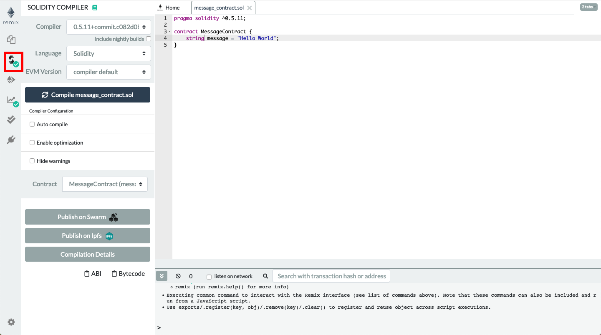

* Click `Compile`:

 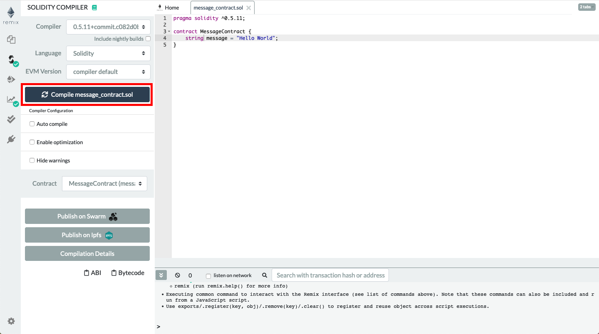

Explain that we will continue to iterate on this example throughout the lesson to add more functionality.

---

### 3. Student Do: Build a Basic Contract (15 min)

In this exercise, students will use their data type cheat sheet to build a basic contract that stores simple variables that represent a rewards/bank account balance.

Explain to the class that by the end of today, we will have to build a simple joint savings account, and that next class, we will add special features like a `timelock` based on a threshold.

**Instructions:**

* [README.md](Activities/02-Stu_Building_a_Basic_Contract/README.md)

**Files:**

* [Unsolved - SimpleCustomerAccount.sol](Activities/02-Stu_Building_a_Basic_Contract/Unsolved/SimpleCustomerAccount.sol)

* [Solved - SimpleCustomerAccount.sol](Activities/02-Stu_Building_a_Basic_Contract/Solved/SimpleCustomerAccount.sol)

---

### 4. Instructor Do: Data Types Review (5 min)

**Files:**

* [SimpleCustomerAccount.sol](Activities/02-Stu_Building_a_Basic_Contract/Solved/SimpleCustomerAccount.sol)

Open the solution and ask students the following questions:

* Why is Solidity so strict with its typing?

 **Answer:** It allows for better error handling in code.

 **Answer:** Contracts should not leave room for ambiguity.

 **Answer:** Being upfront about data types and the size to store them results in less computational overhead/gas costs.

* Why do we have a separate data type for addresses in Solidity?

 **Answer:** Addresses are a fixed size, so it is more cost-effective than a string, which uses a variable amount of storage space.

* What's the difference between an `int` and a `uint`?

 **Answer:** An `int` stores positive and negative numbers, a `uint` only stores positive numbers.

Now that we've thoroughly covered many of the types within Solidity, let's add some functions to our contract!

---

### 5. Instructor Do: Solidity Functions (10 min)

**Files:**

* [LatestTrade.sol](Activities/03-Ins_Solidity_Functions/Solved/LatestTrade.sol)

In this demonstration, the instructor will show the various nuances of functions in Solidity, such as specifying the return type and `public`/`private` modifiers.

Let's say you are a famous crypto trader and want to publish your latest buy order at the price you bought it at. You want to be able to prove that it was you that made that recommendation cryptographically, so you're going to build a smart contract to publish your latest trade to the blockchain.

Open [Remix](http://remix.ethereum.org) and create a new file called `LatestTrade.sol`:

Type the following contract boilerplate:

 ```solidity
 contract LatestTrade {
    string coin = "BTC";
    uint price;
    bool is_buy_order;
 }
 ```

 * First, we are defining a `string` with the default text "BTC" that will be used to store the last coin that we purchased.

 * Next, we are defining a `uint` with the name `price`. This will be used to store the last price that we bought the coin for.

 * Lastly, we are going to define a boolean (true/false value) called `is_buy_order`. If the order is a buy order, we will set this to `true`. If it is a sell order, we will set it to `false`.

Add a function called `updateTrade` to the contract:

 ```solidity
 pragma solidity ^0.5.0;

contract LatestTrade {
    string coin = "BTC";
    uint price;
    bool is_buy_order;

    function updateTrade(string memory newCoin, uint newPrice, bool is_buy) public {
        coin = newCoin;
        price = newPrice;
        is_buy_order = is_buy; /// is this a buy or a sell order?
    }
}
```

 * Now that we have defined our variables for our contract's values, we can create a function to set them.

 * Remember, we have to specify the data type of the parameters as well. We can't get away with ambiguity here like we can in Python!

 * Pay close attention to the keyword `memory` in front of the `newCoin` variable.

 * The reason we specify that the string is stored in `memory` is that strings are a more complex (and thus more expensive) data type than integers and addresses, and the EVM requires you to specify where it is stored.

 * While we operate on the string (like passing it in from a parameter), we can store it in `memory` and use less `gas` than storing a string normally.

 * Since we defined `string coin` at the top of the contract without specifying `memory`, any variable stored in `coin` is permanently written to the blockchain.

Add a function to fetch all of the variables in one shot:

 ```solidity
 function getLatestTrade() public returns (string memory, uint, bool) {
    return (coin, price, is_buy_order);
 }
 ```

 * Now it's time to add a function to fetch all of the defined variables in one shot.

 * Notice that we add the `public` to the function definition, and we also need to specify the return types!

 * Even though functions are `public` by default, Solidity requires us to specify that anyway. What this means is that the function can be called from outside of the contract, either by users or other contracts. If we set this to `private`, the function would only be callable from other functions in the contract.

 * As you might expect, Solidity requires us to specify what types of data this function returns. In this case, we are returning a `string` that will be stored only in `memory` (since we are just fetching the variable), a `uint`, and a `bool`.

 * Since we are just fetching data, calling this function is free! It only costs money to write data to the blockchain or perform calculations on things in `memory`!

 * You can "get" the data all you want, since it's already stored on the blockchain node.

---

### 6. Student Do: Adding a Getter and Setter (15 min)

In this exercise, students will be adding a `Getter` and a `Setter` function to the `SimpleCustomerAccount` contract that they just wrote.

Send out the instructions to the class so that they may begin reviewing the exercise.

**Instructions:**

* [README.md](Activities/04-Stu_Adding_a_Getter_and_Setter/README.md)

**Files:**

* [Unsolved - Getter_Setter.sol](Activities/04-Stu_Adding_a_Getter_and_Setter/Unsolved/Getter_Setter.sol)

* [Solved - Getter_Setter.sol](Activities/04-Stu_Adding_a_Getter_and_Setter/Solved/Getter_Setter.sol)

Have TAs circulate to address any questions that students may have about Solidity functions, their modifiers, and parameters.

* Remember that strings are a more complex datatype and thus require the memory modifier to be specified when you are passing them as a parameter to a function.

* A return statement's values must be contained within parentheses when returning multiple values.

* Functions must contain the public modifier to be accessible outside the contract.

---

### 7. Instructor Do: Review Getters and Setters (5 min)

**Files:**

* [Getter_Setter.sol](Activities/04-Stu_Adding_a_Getter_and_Setter/Solved/Getter_Setter.sol)

Open the solution and explain the following:

* The `getInfo` function should specify the following return types:

  * `address`

  * `bool`

  * `uint`

  * `string memory`

* Inside the `getInfo` we should return the following variables:

  * `owner`

  * `is_new_account`

  * `account_balance`

  * `customer_name`

 ```solidity
 function getInfo() public returns(address, bool, uint, string memory) {
    return (owner, is_new_account, account_balance, customer_name);
 }
 ```

* The `setInfo` function should accept the following parameters:

  * newOwner as an `address` type

  * isNewAccount as a `bool`

  * newAccountBalance as a `uint`

  * newAccountID as `string memory`

* Inside the `setInfo` function, we should set the following variables equal to the following function parameters.

  * `owner` is equal to `newOwner`

  * `is_new_account` is equal to `isNewAccount`

  * `account_balance` is equal to `newAccountBalance`

  * `customer_name` is equal to `newCustomerName`

```solidity
 function setInfo(address newOwner, bool isNewAccount, uint newAccountBalance, string memory newCustomerName) public {
    owner = newOwner;
    is_new_account = isNewAccount;
    account_balance = newAccountBalance;
    customer_name = newCustomerName;
 }
```

Ask for any remaining questions before moving on.

---

### 8. BREAK (15 min)

---

### 9. Instructor Do: Quick Review (10 min)

This activity is a quick review of the concepts learned throughout the first half of today's lesson.

* If I have a function or variable that I want to be able to call from outside the contract, what modifier would I add to the function definition?

 * **Answer:** `public or the public modifier`

* If I pass a parameter into a function, where will I have to store that variable temporarily?

 * **Answer:** `In memory`

* For someone that wants to create a function that stores a given address, what data type would they use?

 * **Answer:** `address data type`

* If you’re writing a function that returns a string and an address, what would be in the returns?

 * **Answer:** `returns(string memory, address)`

* If you’re writing a function that returns a boolean and a string, what would be in the returns?

 * **Answer:** `returns(boolean, string memory)`

Answer any questions before moving on.

---

### 10. Instructor Do: Storing, Catching, Withdrawing Ether (10 min)

**Files:**

* [CustomerSavings.sol](Activities/05-Ins_Storing_Catching_Withdrawing/Solved/CustomerSavings.sol)

In this activity, we will demonstrate how to add functions for depositing ether, withdrawing ether, and a default `fallback` function that can be used to catch ether sent from outside a function call. The `payable` modifier will be introduced and added to payable functions, as well as to payable addresses in the contract.

Earlier in the day, we built a simple contract that stored variables representing a rewards/bank account balance. Let's take that a step further and build a CustomerSavings account smart contract that allows the contract to store, catch and withdraw ether.

Open [Remix](http://remix.ethereum.org) and create a new file called `CustomerSavings.sol`:

Type the following contract boilerplate:

 ```solidity
 pragma solidity ^0.5.0;

 contract CustomerSavings {
    address payable account_one = 0xc3879B456DAA348a16B6524CBC558d2CC984722c;
    address payable account_two = 0xA29f7E79ECEA4cE30DD78cfeb9605D9aFf5143a5;
 }
 ```

 * Once again, we are defining what version of the compiler we want to use by setting the `pragma`.

 * Then, we define the contract and call it `CustomerSavings`.

 * Next, we set two addresses to represent the owners of the joint savings account.

 * Pay special attention to the new modifier that we are using called `payable`. By setting an `address` or function as `payable`, we unlock special functions that allow us to capture and manage ether.

Add a basic withdraw function to the contract.

 ```solidity
 pragma solidity ^0.5.0;

 contract CustomerSavings {
    address payable account_one = 0xc3879B456DAA348a16B6524CBC558d2CC984722c;
    address payable account_two = 0xA29f7E79ECEA4cE30DD78cfeb9605D9aFf5143a5;

    function withdraw(uint amount, address payable recipient) public {
        return recipient.transfer(amount);
    }
 }
 ```

 * For example, if we wanted to withdraw ether from the contract, we can add a withdraw function, like this:

    * Our withdrawal function accepts the following parameters:

    * A `uint` amount representing the amount of ether (in its smallest denomination, Wei) we would like to withdraw.

    * The `address` recipient that we would like to withdraw to.

    * All smart contracts on Ethereum have their own address when deployed, and can store and send ether like a wallet.

 * Address types have built-in functions, like `address.balance`. If we set the address to `payable`, the `.transfer` function is enabled, which allows us to transfer ether from the contract's wallet to that address.

 * Notice that we have the recipient parameter set as a `payable address` in this withdraw function. We still have to be explicit like this in the parameters as well, so that we can call the `.transfer` function on the recipient address later in the function.

Add a `public payable` function named deposit to the contract.

 ```solidity
 pragma solidity ^0.5.0;

 contract CustomerSavings {
    address payable account_one = 0xc3879B456DAA348a16B6524CBC558d2CC984722c;
    address payable account_two = 0xA29f7E79ECEA4cE30DD78cfeb9605D9aFf5143a5;

 function withdraw(uint amount, address payable recipient) public {
    return recipient.transfer(amount);
 }

 function deposit() public payable {}
 }
 ```

 * Now that we can withdraw, let's add the ability to deposit.

 * Remember, all smart contracts on Ethereum have their own address when deployed, and can store and send ether like a wallet. It is up to us to create functions that manage this ether properly, as we did with the withdraw function.

 * When we create a deposit function and set it to `payable`, we are telling the contract to accept the ether that is sent to this function.

 * As you can see, our `deposit` function body is blank; our function does not contain anything. The reason for this is that we only register this function to accept and hold the ether that we send it, and this can be done by just adding the `payable` modifier. We can add more to this function later, like event logging, but for now, we'll do a bare-bones deposit function.

 * We now have a complete contract where any account can send our contract ether through the `deposit` function. It can also send any amount of ether to any address that we specify in the `withdraw` function (as long as we have enough balance, of course!).

Ask the students the following question:

* As you know, moving ether around on the blockchain costs money. What if we don't have enough `gas` to complete the transaction? Do we lose all of the `gas` that was sent?

    * **Answer:** We would lose the gas that was used up already, but the transaction would be reversed, returning our ether  since it was never spent.

We are going to add one final line to make sure that if ether is sent to the contract without using the `deposit` function, (i.e., sending ether directly to the contract's address), we can still capture the ether into the contract's wallet.

* If we don't add this `external payable` fallback function, and ether is sent to our contract address, it will return the ether instead, forcing other users to send via the `deposit` function. In our case, we want to capture all ether sent to the contract.

 ```solidity
 pragma solidity ^0.5.0;

 contract CustomerSavings {
    address payable account_one = 0xc3879B456DAA348a16B6524CBC558d2CC984722c;
    address payable account_two = 0xA29f7E79ECEA4cE30DD78cfeb9605D9aFf5143a5;

 function withdraw(uint amount, address payable recipient) public {
    return recipient.transfer(amount);
 }

 function deposit() public payable {}

 function() external payable {}
 }
 ```

Great! Now we have a fully functioning savings account contract. We can use this smart contract to store ether, and withdraw it to any address we choose!

---

### 11. Student Do: Implementing Ether Management functions (15 min)

In this exercise, students will be implementing a `joint savings account` contract using the ether management functions from the previous activity. By the end of this activity, students will be able to deposit and withdraw ether from their contract's address.

**Instructions:**

* [README.md](Activities/06-Stu_Implement_Ether_functions/README.md)

**Files:**

* [Unsolved - JointSavings_stu_v1.sol](Activities/06-Stu_Implement_Ether_functions/Unsolved/JointSavings_stu_v1.sol)

* [Solved - JointSavings_stu_v1.sol](Activities/06-Stu_Implement_Ether_functions/Solved/JointSavings_stu_v1.sol)

---

### 12. Instructor Do: Review Ether Management Functions (5 min)

**Files:**

* [JointSavings_stu_v1.sol](Activities/06-Stu_Implement_Ether_functions/Solved/JointSavings_stu_v1.sol)

Open the solution and explain the following:

* The `withdraw` function accepts the following parameters:

 * A `uint` named `amount`.

 * A `payable address` named `recipient`.

* Inside the `withdraw` function, we transfer our designated amount to our designated recipient address.

* Remember, since we set our recipient address as payable, we are able to call the built-in `transfer` method and pass it an amount.

 ```solidity
 function withdraw(uint amount, address payable recipient) public {
 recipient.transfer(amount);
 }
 ```

* We also added an empty function called deposit so that our contract can store our `Eth`.

 ```solidity
 function deposit() public payable {}
 ```

* Lastly, we added our payable fallback function so that any `Eth` sent to our contract outside of the deposit function, such as sending `Eth` directly to the contract's address, will also be stored.

 ```solidity
 function() external payable {}
 ```

Ask for any remaining questions before moving on.

---

### 13. Instructor Do: Conditionals in Solidity (10 min)

In this demonstration, we will be discussing how conditionals in Solidity are formatted differently from Python.

To show this, we will be reviewing basic logical operators and control flow to build a basic `TradeController` contract that tracks trades on the Ethereum blockchain.

**Files:**

* [TradeController.sol](Activities/07-Ins_Conditionals/Solved/TradeController.sol)

Explain trade controllers to the class:

* Say you want to build a basic trade controller that will signal whether or not we should be buying, selling, or holding based on a designated price. We're not going to use complex logic, just buy low and sell high. The main goal is to understand the differences in syntax for conditionals.

Then, show the class how to define a `uint` variable called `previous_price` and a `string` variable called `trade_type`.

```solidity
pragma solidity ^0.5.0;

contract TradeController {
 uint previous_price;
 string trade_type;
}
```

* A `uint` is used to define the previous price. This is because the price balances will always be positive and never have a negative balance or negative price.

* The trade type of "Buy" or "Sell" can be stored as a string.

Next, show the class how to define a function called `makeTrade`. We will be passing a `uint` to `makeTrade` that represents the `current_price` of an asset:

```solidity
 function makeTrade(uint current_price) public {}
```

* This `makeTrade` function accepts a `uint` that represents the current price of the asset.

Now let's add a basic conditional to check if the `current_price` we are attempting to trade at is less than the `previous_price` that we traded at:

```solidity
function makeTrade(uint current_price) public {
 if (current_price < previous_price) {
 trade_type = "Buy";
 previous_price = current_price;
 }
}
```

* Just like Python, in Solidity an `if statement` is the keyword `if` followed by a condition that evaluates to `true` or `false`. However, unlike Python, in Solidity, the conditions are contained inside the parentheses.

* Take note that just like when we define the body of a function in Solidity, the body of an `if statement` is also contained in curly brackets.

Now that we have a value for what the `current_price` is, show the class that we can compare that to the `previous_price` to determine whether or not we should buy.

* If the `current_price` is lower than `previous_price`, we set the `trade_type` to the `string` "Buy".

* In the final line inside the `if statement`, we update the `previous_price` to the `current_price` we just traded at to compare against next time.

Add a new `bool` parameter called `buy_anyway` to the `makeTrade` function.

Place `|| buy_anyway` at the end of the condition to allow it to return `true` even if the current price is more expensive than the previous trade price.

```solidity
function makeTrade(uint current_price, bool buy_anyway) public {
 if (current_price < previous_price || buy_anyway) {
 trade_type = "Buy";
 previous_price = current_price;
 }
}
```

Engage the class with the following question:

* What if we want to buy anyway, regardless of the previous price? What operator would allow us to achieve that?

 * **Answer**: This would be a perfect use case for our `||` (or) operator.

Show the class how to modify the code to use the `||` operator to always default to buying, regardless of the previous price.

* First, we add a new `bool` parameter called `buy_anyway`—when we set this to `true`, we can override the price check in the `if` statement by saying `|| buy_anyway`. In plain English, this `if` statement now says, "if the current_price is less than the previous_price, or buy_anyway is set to true, then continue."

* In Python, most logical operators are defined keywords in plain English like `and`, `or`, `not`. However, in Solidity (and many other languages), we have symbols like `&&`, `||`, `!`, respectively.

Add an `else if` with a condition to check if the `current_price` is less than the `previous_price` so that we know when to sell.

```solidity
function makeTrade(uint current_price, bool buy_anyway) public {
 if (current_price < previous_price || buy_anyway) {
 trade_type = "Buy";
 previous_price = current_price;
 } else if (current_price > previous_price) {
 trade_type = "Sell";
 previous_price = current_price;
 } else {
 trade_type = "Hold";
 }
}
```

* If the `current_price` is more than the `previous_price` and we do not want to `buy_anyway`, then we are going to sell, so we move to the `else if`.

* If the first two conditions evaluate to `false`, then we are going to set the `trade_type` to `Hold` because we cannot currently buy or sell.

Now it's time for the students to use some conditionals in Solidity!

---

### 14. Student Do: Using If/Else in Solidity (10 min)

In this activity, students will add to their `JointSavings` contract functionality that uses if/else statements.

In this case, we are adding an `address` called `last_used` to keep track of which was the last withdraw address. `If` the latest address is different from the `last_used`, then update `last_used`.

Send out the instructions, which include a cheat sheet that compares how conditionals work in Python vs. Solidity.

**Instructions:**

* [README.md](Activities/08-Stu_If_Else/README.md)

**Files:**

* [JointSavings_stu_v2.sol](Activities/08-Stu_If_Else/Unsolved/JointSavings_stu_v2.sol)

* [Conditionals Cheat Sheet](Activities/08-Stu_If_Else/Resources/Conditionals_Cheatsheet.md)

Have the TAs circulate the class to ensure that students are correctly implementing their if/else statements. Remind them that they have to:

* Put the condition in parentheses.

* Put the body of the if statement in curly brackets.

---

### 15. Instructor Do: Conditionals Review (5 min)

**Files:**

* [JointSavings_stu_v2.sol](Activities/08-Stu_If_Else/Solved/JointSavings_stu_v2.sol)

Open the solution and explain the following:

* Inside the `withdraw` function, we added a check to make sure that the accounts that we are withdrawing funds to are one of the two account owners.

* We took the previous `recipient.transfer(amount)` line and moved it inside of our `if/then` block; now, this code will only execute if the condition returns `true`.

* Inside the condition itself, we are checking that `recipient` is equal to `account_one` or `recipient` is equal to `account_two`.

 ```Solidity
 if (recipient == account_one || recipient == account_two) {
    recipient.transfer(amount);
 }
 ```

Ask for any remaining questions before moving on.

---

### 16. Everyone Do: Restricting the Withdraw Function with Require (20 min) (Critical)

In this activity, we will be replacing our `if` conditional statement with a `require` function.

**Files:**

* [Unsolved - JointSavings_ins_v1.sol](Activities/09-Ins_Restricting_Withdraw_With_Require/Solved/JointSavings_ins_v1.sol)

Have students follow along while you code.

Continue with the `JointSavings.sol` contract in [Remix](https://remix.ethereum.org) and ensure that students have theirs open as well.

Up to this point, everyone's contract should look like this:

```solidity
pragma solidity ^0.5.0;

contract JointSavings {
  address payable account_one = 0xc3879B456DAA348a16B6524CBC558d2CC984722c;
  address payable account_two = 0xA29f7E79ECEA4cE30DD78cfeb9605D9aFf5143a5;

  function withdraw(uint amount, address payable recipient) public {
    if (recipient == account_one || recipient == account_two) {
        recipient.transfer(amount);
    }
  }

 function deposit() public payable {}

 function() external payable {}
}
```

Explain to the class:

* Even though this contract is logically sound, there is a special function we need to use called `require` to enforce the account check
 instead of using the `if` statement.

* The `require` function checks a condition just like an `if` statement does, only if the condition is false, it will return the leftover `gas` used and any `ether`, and roll back the entire transaction. Consider it a hard stopping point that you absolutely `require` a specific condition to be true to continue.

Remove the `if` statement, then replace it with the following `require`:

```solidity
function withdraw(uint amount, address payable recipient) public {
    require(recipient == account_one || recipient == account_two, "You do not own this account!");
    recipient.transfer(amount);
}
```

Have the students catch up with the code, then elaborate:

* The require is just like an `if/else` else statement checks if an expression returns `true`.

* If the expression returns `true`, then the code after the declaration is executed.

* The significant difference between an `if/else` and a `require` is a fundamental one.

* When an `if/else` is false, the code inside the `if` statement does not execute, but the contract as a whole continues to execute as if everything was successful, thus continuing to spend the gas that was allotted to the contract call.

* Unlike the `if/else` when a `require`'s condition fails, the contract immediately ends execution, and the remaining gas is returned to the person that executed the contract.

* You can think of a `require` more as a type of error handling; as you can see, we can even declare a custom error message to the user. If withdraw has passed an address that is not one of the two addresses defined in our contract, then they will get the message `You do not own this account!`.

Now we have a fully working `JointSavings` account with withdrawing protection on our contract account and a deposit function to deposit our funds. Let's compile and deploy our contract to test it out!

---

### 17. Everyone Do: Deploying a Contract in Remix (10 min)

In this activity, students will take their `JointSavings` account contract, compile and deploy it on their local `testnet`.

**Files:**

* [JointSavings_ins_v2.sol](Activities/10-Ins_Deploying_Contracts_in_Remix/Solved/JointSavings_ins_v2.sol)

Let's compile and deploy our contract to test it out!

Perform the following:

* Start by having everyone open the `Ganache` application. Instruct everyone to select the workspace we previously configured.

 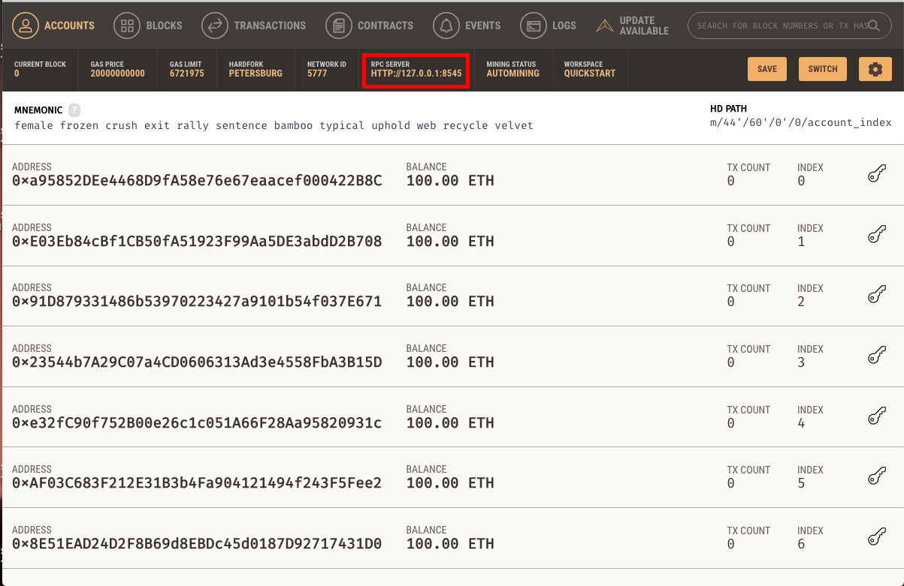

* Ensure the students all have Ganache running before moving on.

 * You should see your servers running on `http://127.0.0.1:8545`

 * Navigate to [Remix](http://remix.ethereum.org/) in your browser and open the `JointSavings_ins_v2.sol` contract.

 * Now open MetaMask, and enter the password to unlock your account, then make sure the network is "Localhost 8545".

 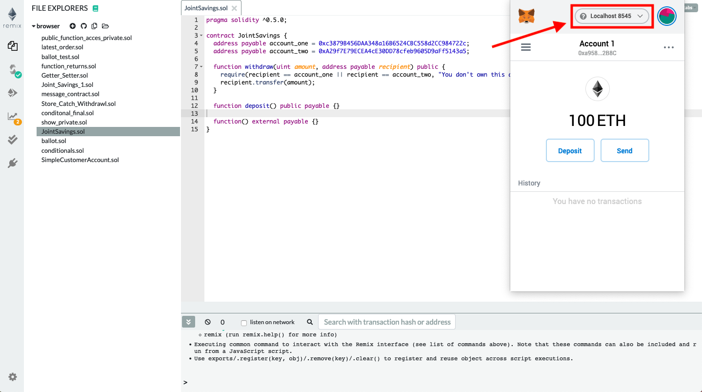

 * You should now see your primary wallet balance in MetaMask.

* Click the `Deploy & Run Transaction` button in the Remix sidebar.

 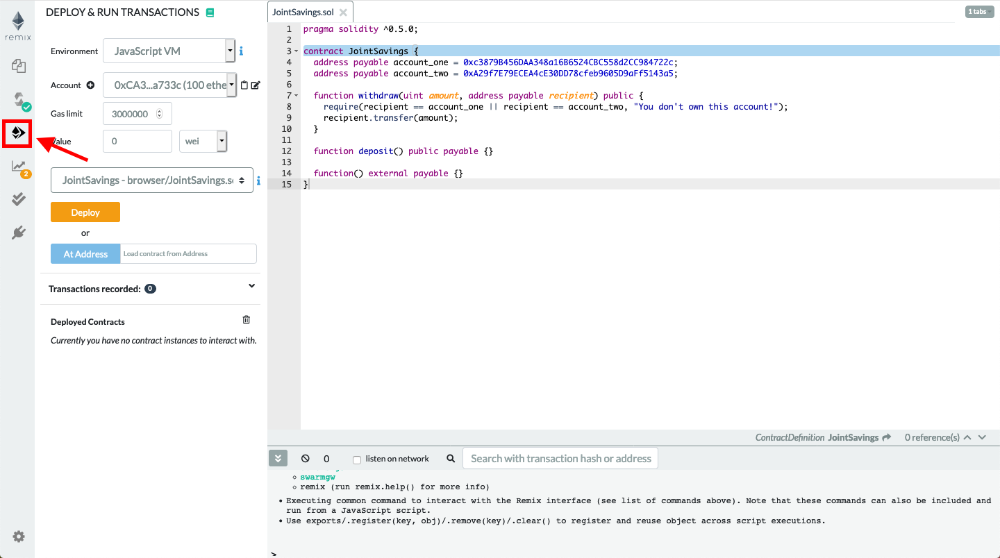

 * Ensure that all students are on the deploy tab before moving forward.

* Now click the environment dropdown menu. By default, it will have `Javascript VM` checked, switch this to `Injected Web3`. This will allow Metamask to send our contract `Eth`.

 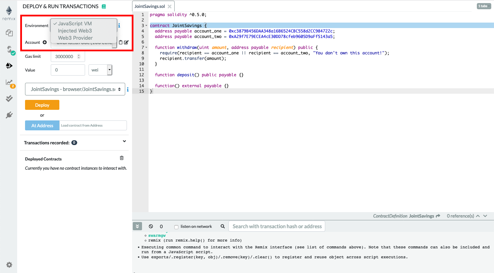

* You may be prompted to connect your account in MetaMask to remix.

 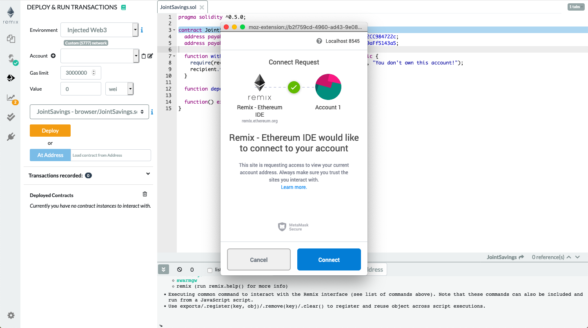

* Click the yellow `Deploy` button to deploy the contract, then `Confirm` in MetaMask.

 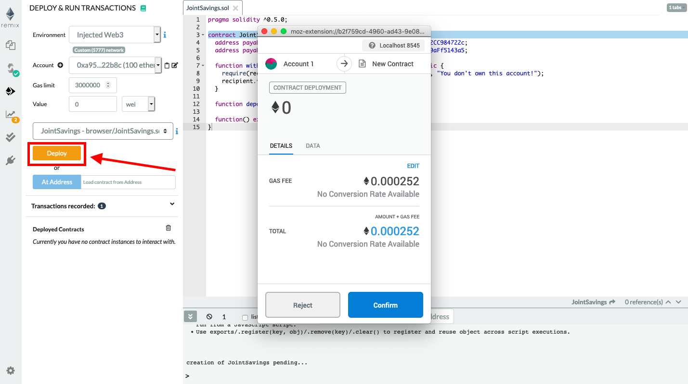

* Pause while the students deploy their contracts.

* If your contract successfully deployed, it should now appear as a grey box under deployed contracts at the bottom of the deploy sidebar.

 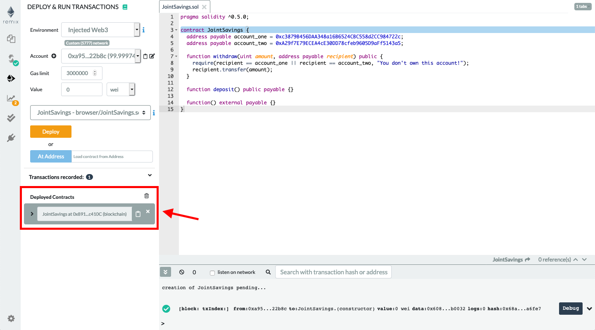

* Click the dropdown arrow next to the grey deployed contract to display the contract's functions that can be called.

 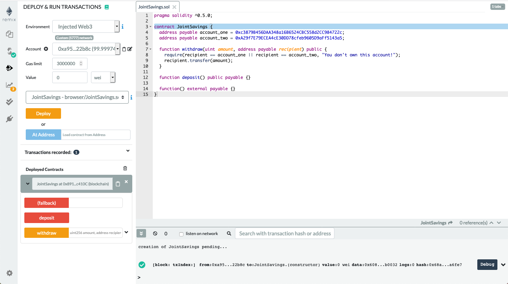

Discuss with the students:

* These are the functions that are publicly callable from the contract.

* As you can see, all of the functions have an input that allows you to send the function parameters.

* Notice that the deposit function does not have an input next to it. This is because it does not have any parameters. Instead, you will pass it ether through the value field at the top.

Lead students through passing `10 ether` into the deposit function, and then withdrawing it.

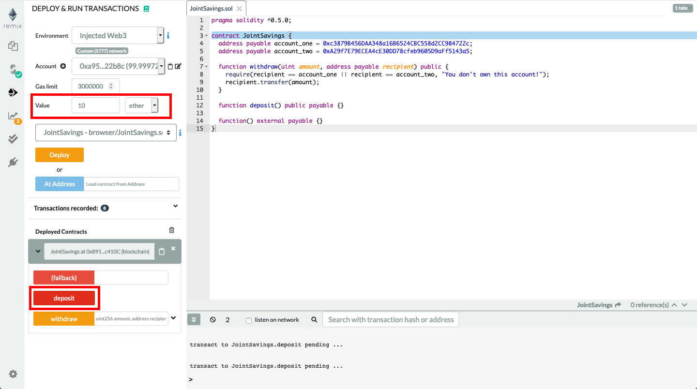

* We are now going to deposit some ether into our `JointSavings` account.

* Locate the value field and enter `10` into the input box. Then, change the dropdown menu to the denomination `ether`. This is saying that we are going to send `10 ether` in this transaction.

* Now click the `Deposit` button under the deployed contract.

 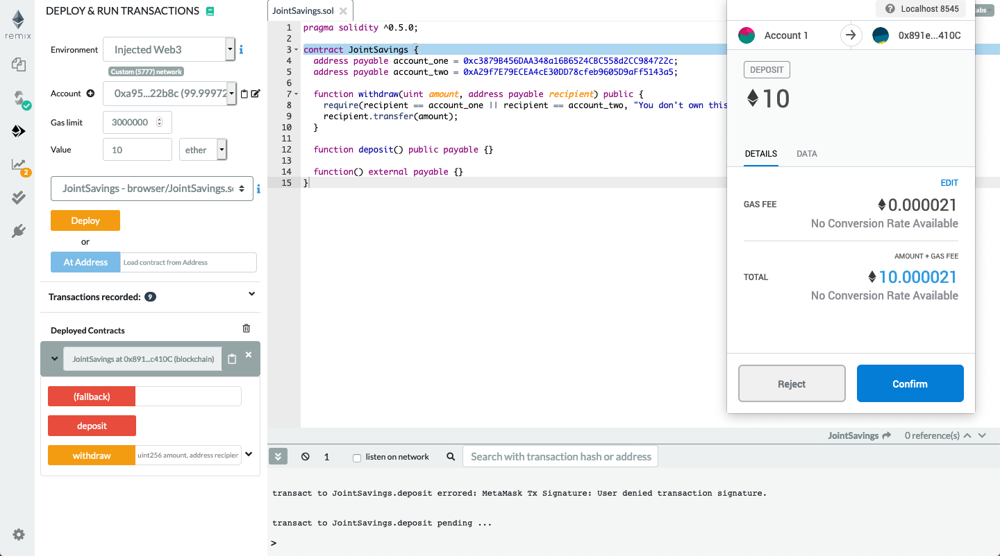

* You will be prompted by MetaMask to confirm the amount. Click `Confirm`.

Have students confirm that that the `10 eth` was subtracted from their wallet in MetaMask.

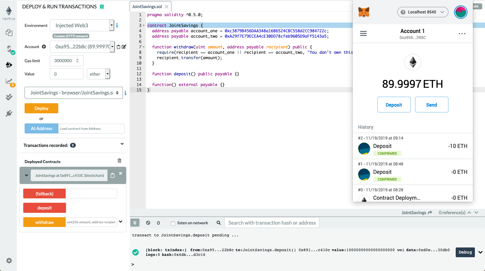

* Reopen your MetaMask wallet, and check to make sure that your deposited `eth` is subtracted from your wallet balance.

Lead students through withdrawing the `10 eth` from their `Jointsavings` account back to their wallet. Have students open their MetaMask wallet and copy their address at the top:

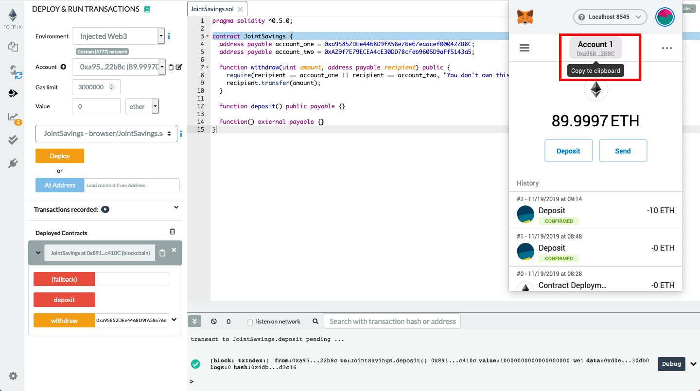

* Reopen your meta mask wallet and click your address at the top to copy it to your clipboard.

* Double-check to make sure that this address matches one of your two addresses in your `JointSavings` account contract.

Since we defined the `amount` variable as a `uint256` we are working with the smallest denomination of `ether` called `wei`. Before we can withdraw our `10 ether`, we must convert it to an equivalent amount of `wei`.

We can do this in many ways: we can either use `Web3.py`, a website like [eth-converter.com](eth-converter.com), or we can remember that `1 ether` is equivalent to 1 * 10^18 `wei`. That's right—we can specify incredibly small amounts of `ether` by using `wei`. In our case, `10 ether` is `10000000000000000000 wei`—aka 1 with 19 zeros after it.

Call the `Withdraw` function and pass it `10 ether` (in `wei`) and the address to withdraw to.

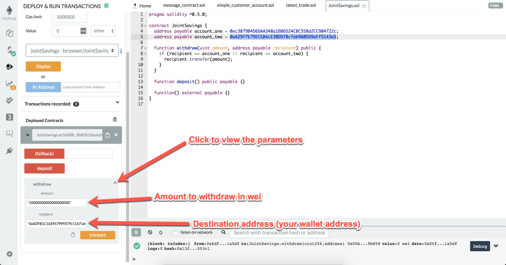

* Now call the `Withdraw` function and pass it 10 `ether` (in `wei`) and your address that you would like to withdraw the funds to.

* You will have to open `MetaMask` to confirm the transaction if it does not open automatically.

 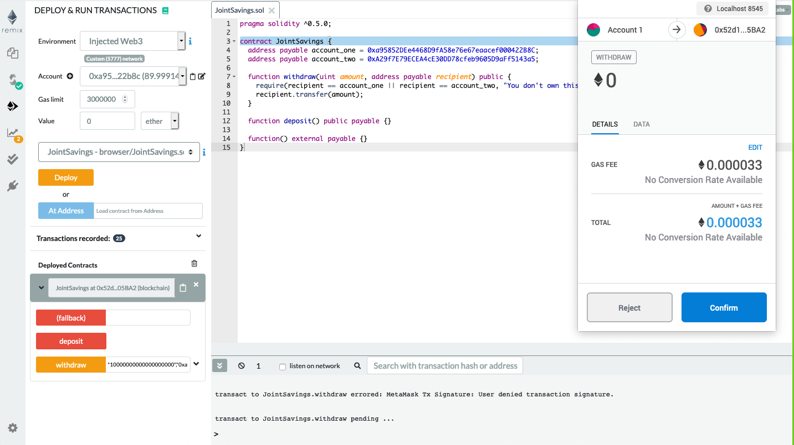

Click confirm in the `MetaMask` window.

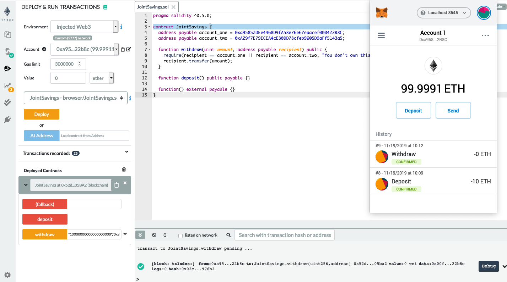

* You should now see a confirmed `Deposit` transaction, a confirmed `Withdraw` transaction, and your `MetaMask` wallet should now once again contain the additional `10 ether`.

Congratulations—you have now written, compiled, deployed, and executed your first smart contract!

Not only have you written a smart contract, but you have learned a strictly typed programming language which will enable you to write super precise and fast code.

---

### 18. Instructor Do: End of Day Recap (5 min)

Ask the following review questions.

* What is Solidity?

 * **Answer** Solidity is:

 * A high-level, object-oriented programming language.

 * It is the language used to write smart contracts on the Ethereum blockchain.

 * Is strictly typed.

* What advantages would a language have for specifying the type?

 * **Answer:** Specifying the data types allow the language to use the most optimal storage container for the data, thus saving space. This is especially important for smart contracts, because it costs money to store data.

 * **Answer:** When the language is dealing with finance, you want the code to be very precise and accurate.

 * **Answer:** Types can be used by the compiler for error-checking.

* If I pass a parameter into a function, where will I have to temporarily store that variable?

 * **Answer** `In memory`

* As you know, moving ether around on the blockchain costs money. What if we don't have enough `gas` to complete the transaction? Do we lose all of the gas that was sent?

 * **Answer:** We do lose the gas that was used up already, but the transaction will be reversed, and we would get our ether back since it was never successfully spent.

* Why do we use a `testnet` to test our code?

 * **Answer** Ether costs real money on `mainnet`; we don't want to waste real money testing code.

 * **Answer** Until our code is fully tested, we might not uncover certain bugs or potential security vulnerabilities; `testnet` gives us a way to run our code as if it's in production, without it being in production.

Conclude class by congratulating students on learning the basics of a brand new programming language! Solidity is a highly sought after skill that many companies are interested in.

---

### End Class

---

© 2020 Trilogy Education Services, a 2U, Inc. brand. All Rights Reserved.
